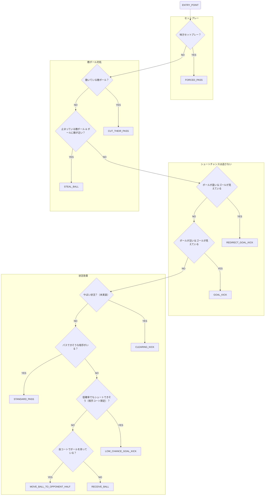

# Attackerスキル

- ENTRY_POINT
- FORCED_PASS
- CUT_THEIR_PASS
- STEAL_BALL
- REDIRECT_GOAL_KICK
- GOAL_KICK
- CLEARING_KICK
- STANDARD_PASS
- LOW_CHANCE_GOAL_KICK
- MOVE_BALL_TO_OPPONENT_HALF
- RECEIVE_BALL

