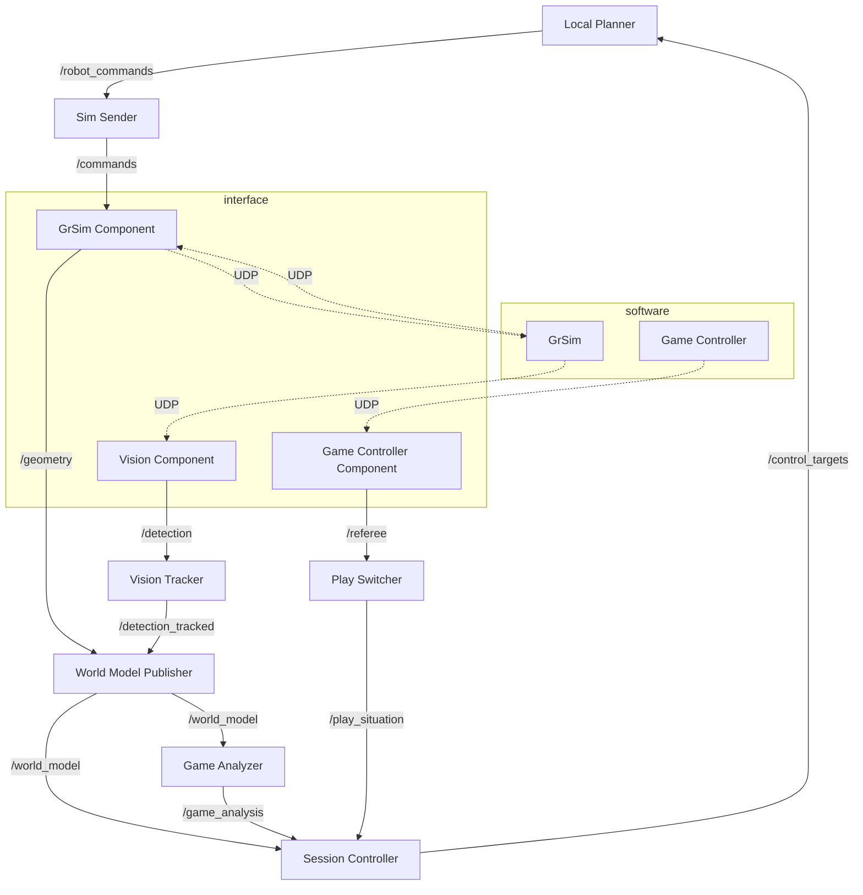

# ノードダイアグラム

```mermaid
graph TD
    LP[Local Planner]
    PS[Play Switcher]
    GA[Game Analyzer]

    subgraph interface
        VC[Vision Component]
        GrC[GrSim Component]
        GCC[Game Controller Component]
    end

    SC[Session Controller]
    SS[Sim Sender]


    VT[Vision Tracker]
    WP[World Model Publisher]

    subgraph software
        GrSim[GrSim]
        GC[Game Controller]
    end

    WP -- /world_model -->  SC
    WP -- /world_model -->  GA
    GA -- /game_analysis -->  SC


    GrC -. UDP .->  GrSim

    GrSim -. UDP .->  GrC
    GrC -- /geometry -->  WP

    GrSim -. UDP .->  VC


    VC -- /detection -->  VT
    VT -- /detection_tracked -->  WP

    GC -. UDP .->  GCC
    GCC -- /referee -->  PS
    PS -- /play_situation --> SC
    SC -- /control_targets --> LP
    LP -- /robot_commands -->  SS
    SS -- /commands -->  GrC


```
