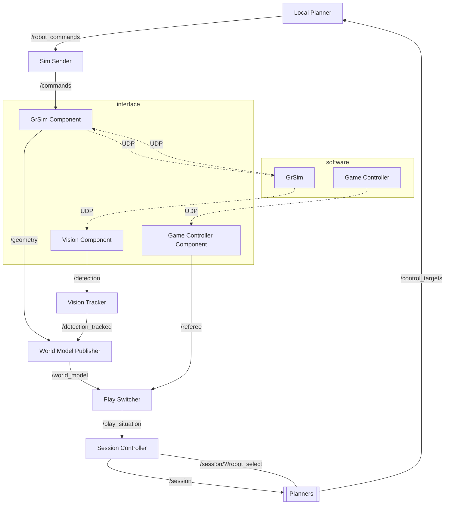

```mermaid
graph TD
    LP[Local Planner]
    PLs[[Planners]]
    PS[Play Switcher]
    
    subgraph interface
        VC[Vision Component]
        GrC[GrSim Component]
        GCC[Game Controller Component]
    end
    
    SC[Session Controller]
    SS[Sim Sender]
    
    
    
    VT[Vision Tracker]
    WP[World Model Publisher]
    
    subgraph software
        GrSim[GrSim]
        GC[Game Controller]
    end
    
    WP -- /world_model -->  PS


    GrC -. UDP .->  GrSim
    
    GrSim -. UDP .->  GrC
    GrC -- /geometry -->  WP

    GrSim -. UDP .->  VC
    
    
    VC -- /detection -->  VT
    VT -- /detection_tracked -->  WP
    
    GC -. UDP .->  GCC
    GCC -- /referee -->  PS
    PS -- /play_situation --> SC
    SC -- /session -->  PLs
    PLs -- /control_targets -->  LP
    LP -- /robot_commands -->  SS
    SS -- /commands -->  GrC
    
    
    SC -- /session/?/robot_select ---  PLs
```

