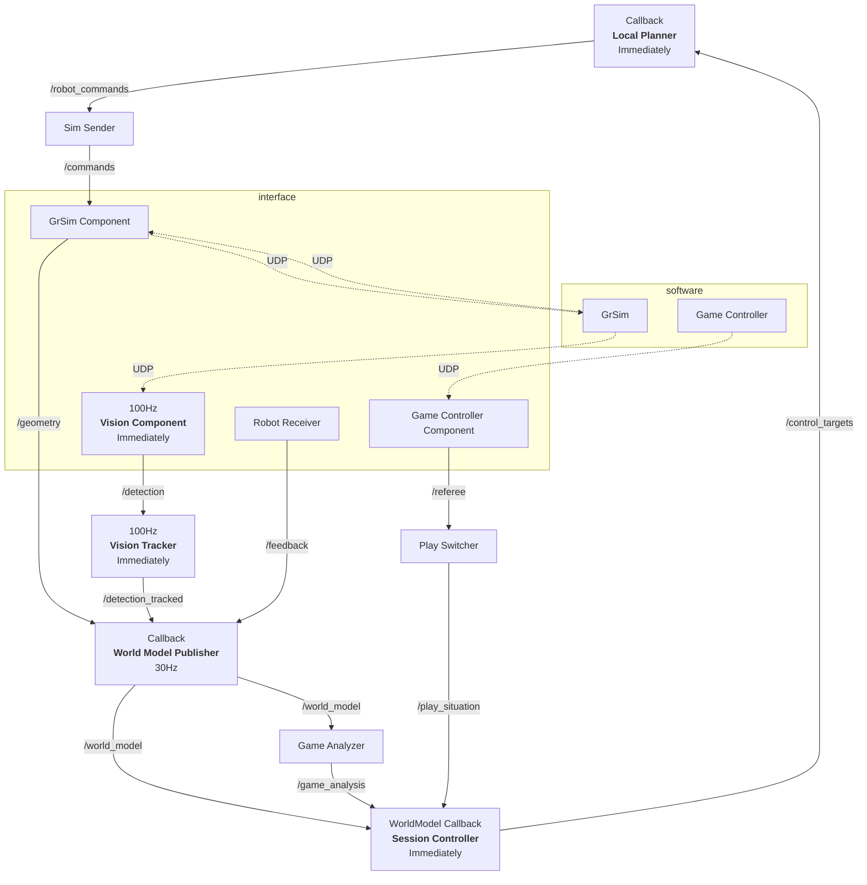

# 遅延のボトルネック解析

<https://github.com/ibis-ssl/crane/issues/130>

## Timer/Callback駆動

まずは現状分析

- 下流はほとんどコールバック駆動なので良し
- Vision Component
  - 非同期で受け取ってUDPコールバックにしても良いかも
  - これは絶対に受け取った時刻を一緒に情報として持っておくべき
- Vision Tracker
  - フィルター処理はタイマー駆動必要かも
  - これ以降の処理はコールバックで一気通貫したい
    - 柔軟性的にはフィルター処理コールバック周期と出力周期は変えたいかも
    - いい感じ補間処理入れたら出力周期変えてもpublish時の最新の情報を出せる？
