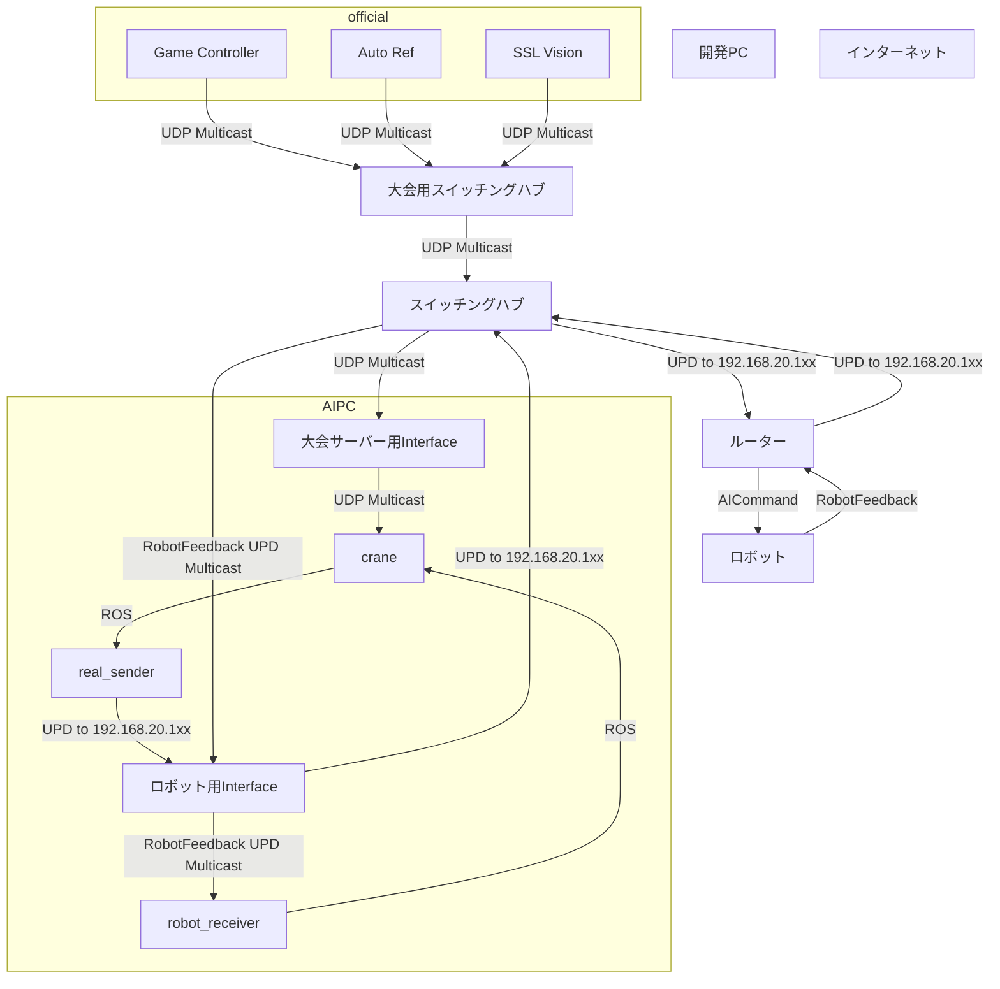

# ネットワーク設定

## ROS関連

<https://autowarefoundation.github.io/autoware-documentation/pr-347/installation/additional-settings-for-developers/#network-settings-for-ros-2>

### ローカルホストでマルチキャスト

```bash
sudo ip link set multicast on lo
```

### マルチキャストアドレスとデバイスの対応の確認

```bash
netstat -g
```

### マルチキャストアドレスへのルートの追加

```bash
sudo ip route add <address> dev <device>
```

## インターネット接続とロボット接続の共存

ロボットのアドレスに対して静的ルーティングを設定する

`/etc/netplan/01-network-manager-all.yaml`

```yaml
network:
  version: 2
  renderer: networkd
  ethernets:
    enp3s0:
      addresses:
        - 192.168.1.2/24
      gateway4: 192.168.1.1
      routes:
        - to: 192.168.2.0/24
          via: 192.168.1.1
        - to: 192.168.3.0/24
          via: 192.168.1.1
```


