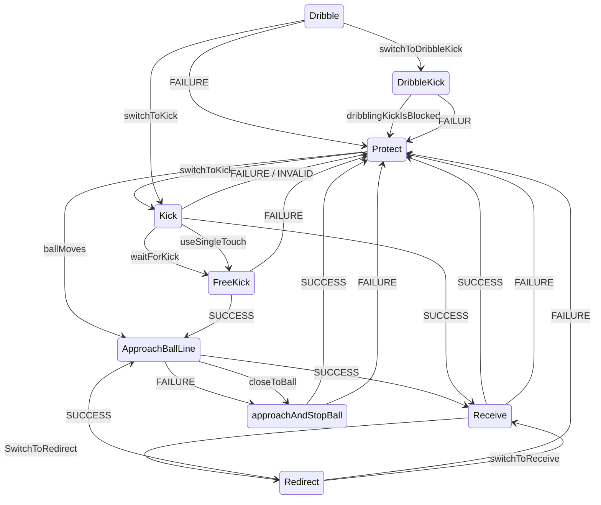
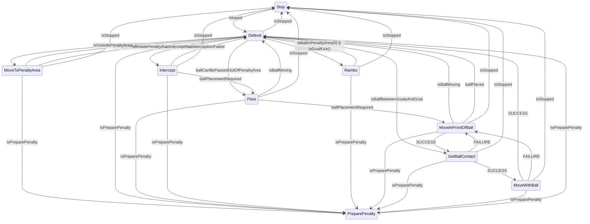
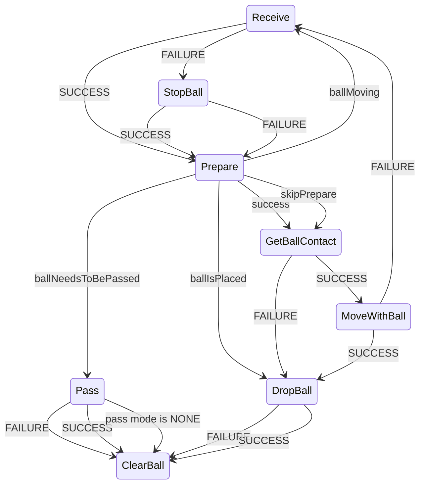

# TIGERs Sumatra

## Attackerの状態機械

<https://github.com/TIGERs-Mannheim/Sumatra/blob/master/modules/moduli-ai/src/main/java/edu/tigers/sumatra/ai/pandora/roles/offense/attacker/AttackerRole.java>

## Keeperの状態機械

## BallPlacementの状態機械

## AOffensiveActionMoves

TDP2018に解説されている。

- ForcedPass
- DirectKick
  - 敵ゴールへの直接シュート
- ClearingKick
  - 味方の危ない状況からのクリア
- StandardPass
- LowChanceKick
  - 敵ゴールへの直接シュート
- GoToOtherHalf
  - 自陣でボールをキープしているが適切なパスターゲットがない場合
- KickInsBlue
  - 敵ロボットがいない場所にボールを蹴る
- RedirectGoalShot
- RedirectPass
- Receive
