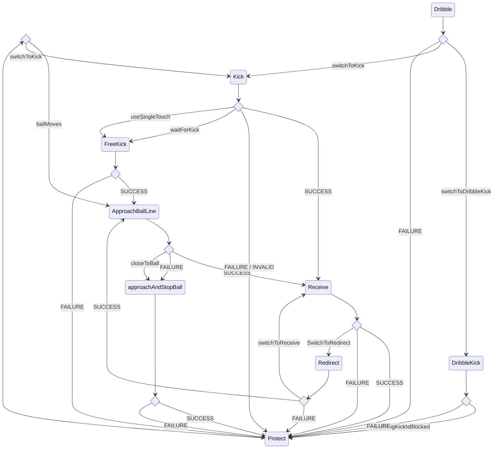

# TIGERs Sumatra

## Attackerの状態機械

https://github.com/TIGERs-Mannheim/Sumatra/blob/master/modules/moduli-ai/src/main/java/edu/tigers/sumatra/ai/pandora/roles/offense/attacker/AttackerRole.java

```mermaid
stateDiagram-v2
    state Protect_if <<choice>>
    Protect --> Protect_if
    Protect_if --> ApproachBallLine: ballMoves
    Protect_if --> Kick : switchToKick

    state Dribble_if <<choice>>
    Dribble --> Dribble_if
    Dribble_if --> DribbleKick: switchToDribbleKick 
    Dribble_if --> Kick: switchToKick
    Dribble_if --> Protect: FAILURE

    state ApproachBallLine_if <<choice>>
    ApproachBallLine --> ApproachBallLine_if
    ApproachBallLine_if --> Receive: SUCCESS
    ApproachBallLine_if --> approachAndStopBall: FAILURE
    ApproachBallLine_if --> approachAndStopBall: closeToBall

    state approachAndStopBall_if <<choice>>
    approachAndStopBall --> approachAndStopBall_if
    approachAndStopBall_if --> Protect: SUCCESS
    approachAndStopBall_if --> Protect: FAILURE

    state Kick_if <<choice>>
    Kick --> Kick_if
    Kick_if --> Receive: SUCCESS
    Kick_if --> Protect: FAILURE / INVALID
    Kick_if --> FreeKick: waitForKick
    Kick_if --> FreeKick: useSingleTouch

    state FreeKick_if <<choice>>
    FreeKick --> FreeKick_if
    FreeKick_if --> ApproachBallLine: SUCCESS
    FreeKick_if --> Protect: FAILURE

    state Receive_if <<choice>>
    Receive --> Receive_if
    Receive_if --> Protect: SUCCESS
    Receive_if --> Protect: FAILURE
    Receive_if --> Redirect: SwitchToRedirect

    state Redirect_if <<choice>>
    Redirect --> Redirect_if
    Redirect_if --> ApproachBallLine: SUCCESS
    Redirect_if --> Protect: FAILURE
    Redirect_if --> Receive: switchToReceive

    state DribbleKick_if <<choice>>
    DribbleKick --> DribbleKick_if
    DribbleKick_if --> Protect: dribblingKickIsBlocked
    DribbleKick_if --> Protect: FAILURE
```

