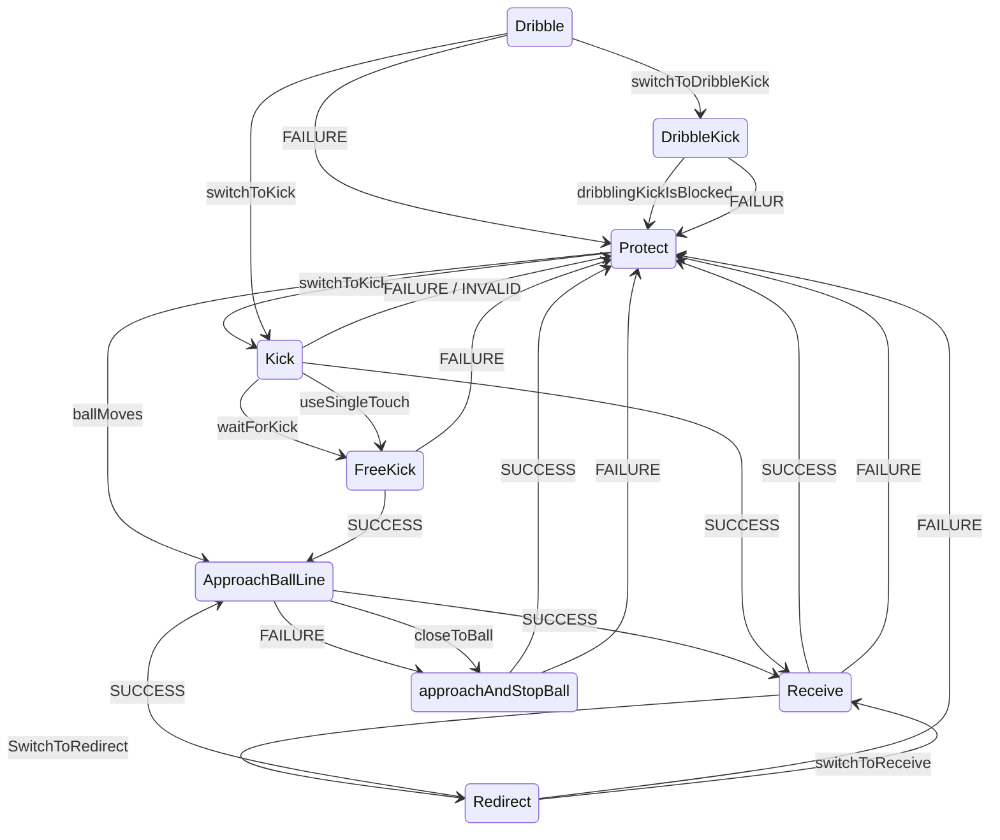
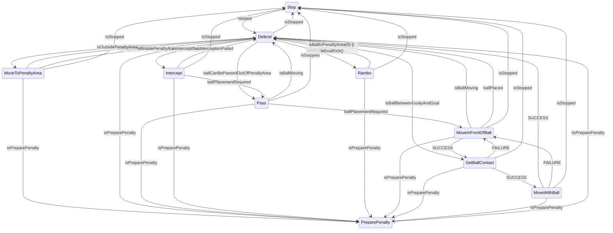
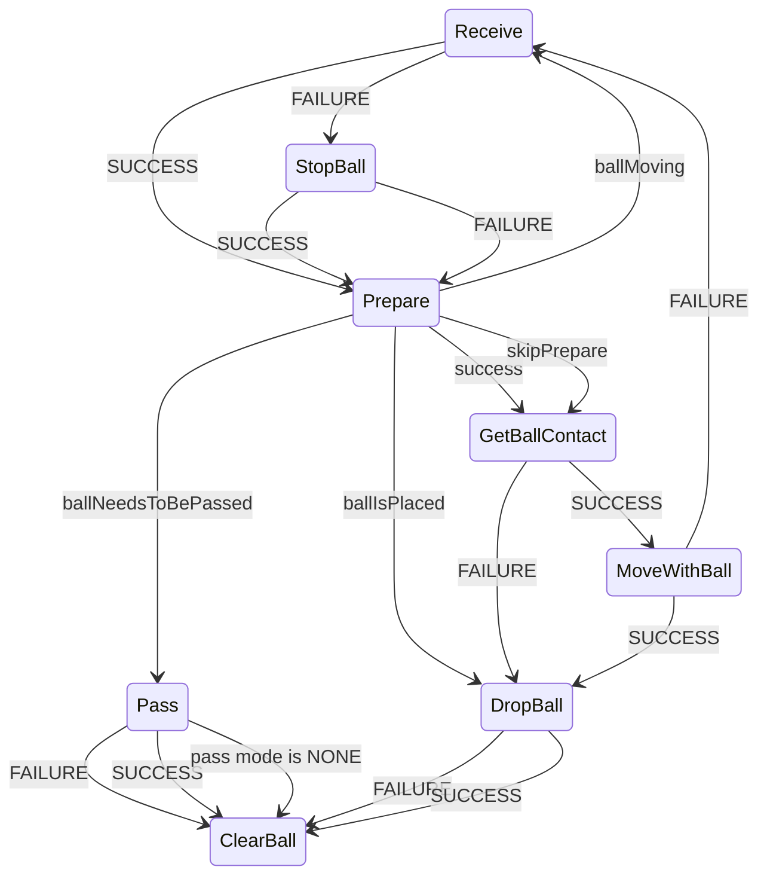

# TIGERs Sumatra

## Attackerの状態機械

<https://github.com/TIGERs-Mannheim/Sumatra/blob/master/modules/moduli-ai/src/main/java/edu/tigers/sumatra/ai/pandora/roles/offense/attacker/AttackerRole.java>

## Keeperの状態機械

## BallPlacementの状態機械

## AOffensiveActionMoves

TDP2018に解説されている。

- ForcedPass
- DirectKick
  - 敵ゴールへの直接シュート
- ClearingKick
  - 味方の危ない状況からのクリア
- StandardPass
- LowChanceKick
  - 敵ゴールへの直接シュート
- GoToOtherHalf
  - 自陣でボールをキープしているが適切なパスターゲットがない場合
- KickInsBlue
  - 敵ロボットがいない場所にボールを蹴る
- RedirectGoalShot
- RedirectPass
- Receive

### ベースクラス（2018年時点でのもの）

<https://github.com/TIGERs-Mannheim/Sumatra/blob/e858a04f90d5f9d0c0d9df0e4fd913e66d386e6c/modules/moduli-ai/src/main/java/edu/tigers/sumatra/ai/metis/offense/action/moves/AOffensiveActionMove.java>

※viability: 実行可能性

- isActionViable
  - そのアクションが実行可能かどうかを返す
  - 返り値
    - TRUE
    - PARTIAL
    - FALSE
- activateAction
- calViabilityScore

### ベースクラス(2021年時点でのもの)

calcAction

#### 返り値：OffensiveAction

- move:EOffensiveActionMove(PROTECT_MOVE)
  - FORCED_PASS
  - REDIRECT_GOAL_KICK
  - GOAL_KICK
  - CLEARING_KICK
  - STANDARD_PASS
  - LOW_CHANCE_GOAL_KICK
  - MOVE_BALL_TO_OPPONENT_HALF
  - KICK_INS_BLAUE
  - RECEIVE_BALL
  - PROTECT_MOVE
- action:EOffensiveAction(PASS)
  - PASS
  - KICK_INS_BLAUE
  - CLEARING_KICK
  - GOAL_SHOT
  - PROTECT
  - REDIRECT
  - RECEIVE
- viability:OffensiveActionViability
  - TRUE
  - PARTIAL
  - FALSE

### ベースクラス(2023年時点でのもの)

<https://github.com/TIGERs-Mannheim/Sumatra/blob/master/modules/moduli-ai/src/main/java/edu/tigers/sumatra/ai/metis/offense/action/EOffensiveActionType.java>

- type:OffensiveActionType
  - PASS
  - REDIRECT_KICK
  - DRIBBLE_KICK
  - PROTECT
  - CHOP_TRICK
    - Hackentrick: かかとで後方にけり、相手をかわす技
  - RECEIVE

<https://github.com/TIGERs-Mannheim/Sumatra/blob/master/modules/moduli-ai/src/main/java/edu/tigers/sumatra/ai/metis/offense/action/moves/EOffensiveActionMove.java>

- OffensiveActionMoveの種類
  - REDIRECT_GOAL_KICK
  - CHOP_TRICK
  - FINISHER
  - GOAL_KICK
  - FORCED_PASS
  - CLEARING_KICK
  - STANDARD_PASS
  - LOW_CHANCE_GOAL_KICK
  - MOVE_BALL_TO_OPPONENT_HALF
  - RECEIVE_BALL
  - PROTECT_MOVE

build関数はOffensiveActionTypeのラインナップをサポート

<https://github.com/TIGERs-Mannheim/Sumatra/blob/master/modules/moduli-ai/src/main/java/edu/tigers/sumatra/ai/metis/offense/action/RatedOffensiveAction.java>

- RatedOffensiveAction
  - buildProtect
  - buildChopTrick
  - buildPass
  - buildKick
  - buildRedirectKick
  - buildDribbleKick
  - buildReceive

### ForcedPass

フリーキックのような、必ずパスしなければいけない状況で使われる。

<https://github.com/TIGERs-Mannheim/Sumatra/blob/master/modules/moduli-ai/src/main/java/edu/tigers/sumatra/ai/metis/offense/action/moves/ForcedPassActionMove.java>

### FinisherActionMove

ドリブルしながらゴールを狙うアクション

### ClearingKickActionMove

ボールをゴール中心から離れる方向にチップキックする

- TRUE
  - ボールがゴールに近い＆壁デフェンスが間に合ってない＆ボールが相手に近い＆自コートにボールがある＆ボールが0.3m/s以下
- FALSE
  - それ以外

### ProtectActionMove

## PassGenerator

https://github.com/TIGERs-Mannheim/Sumatra/blob/5e99731884440591f633e65b01118f291f460d4e/modules/moduli-ai/src/main/java/edu/tigers/sumatra/ai/metis/pass/PassGenerator.java

## KIckOriginという概念

https://github.com/TIGERs-Mannheim/Sumatra/blob/259774013fe5fef0c5eeff46db5f04c3f7d61f56/modules/moduli-ai/src/main/java/edu/tigers/sumatra/ai/metis/pass/KickOrigin.java

次にボールがキックされる点。

ボールが動いていないときは、ボールの場所であり、動いているときは以下のいずれかが発生したときである。

- (相手ボールのとき)ボールをカット
- ボールをキャッチ
- ボールをリダイレクト

impact time: ボールがKickOriginに到着するまでの時間
