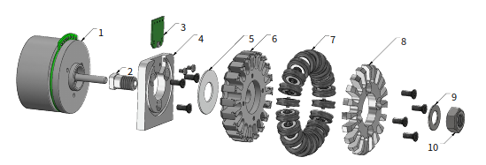

## TDP2023

<https://tdp.roboteamtwente.nl/tdps/144?ref=year>

### 軌道生成

ゴールキーパーのような、ゴール地点で速度ゼロにならなくても場所と時間さえあっていればOKというケースに対応して有効守備範囲を広げている。

## TDP2022

<https://tdp.roboteamtwente.nl/tdps/241?ref=year>

### ハードウェアアップデート

- ドリブラのダンパ
- 自分のマーカーを読み取るシステム

### ビルトインなシミュレータについて

- grSimは低レイヤー制御も含むので、AIの検証用に理想的な動作をするシミュレータを作った（2013~）
- 基本的に2Dだが、チップキックだけは3D対応
- デバッグが簡単
  - ステップ実行可能
  - 状況を巻き戻して再実行も可能
- シミュレータの比較
  - grSim
  - ER-Forceのもの
- シミュレータを使ったテストも簡単に作れる

### 攻撃用ドリブル

- 2021年大会の優勝で大きな役割を果たした
- ペナルティエリアの平行線上でサンプリングして評価
- サンプリングする点はドリブル最大距離まで
- ゴール可能な最近傍点を選んでそこまでドリブルする

### 視覚化

- ROSのvisualization_msgsのMarkerみたいなコンテキストを含まない視覚化プロトコルの定義
- Rootsにも影響を与えている
  - <https://docs.google.com/presentation/d/1E1aGzgUJE3eE8vYH-kmbULuU4uvnsyrLjKkdK6fHre4/edit?usp=sharing>
  - <https://github.com/SSL-Roots/consai_ros2/pull/128>

### データの記録

- 1試合のログは数GB
  - 圧縮したら数百MB
- ログ再生機でコピーしたらロボット・フィールド状態がjson形式でクリップボードに
- シミュレータ上でペーストすると状態が再現される

### テスト

シミュレータを組み込んでのテスト

- パスカット
- リダイレクトシュート

#### ルールのテスト

- 対戦相手なしでFORCE_START：10s以内にゴールできるか
- KICKOFF: 11s以内にロボットが動き出すか？
- PENALTY: ロボットが動き出し、30s以内にゴールしてHALTになるか外してBallPlacementになっているか？
- FORCESTART: ボールが蹴られて動き出すか？
- Pass: ロボットが時間内に目的地に到着するか？
- STOP: STOP中にロボットが最大速度を超えて移動していないか？禁止エリアに入らないか？
- BallPlacement: 時間以内に成功するか？
- KICKOFF: 相手無しで11s以内にゴールできるか？
- INDIRECT FREE: 6s以内にロボットが移動するか？

## TDP2020

<https://tdp.roboteamtwente.nl/tdps/89?ref=year>

### ハードウェア v2020(Gen5)

- 前のバージョンはv2019
- メカ中心のアップデートで回路はほぼ同じ

#### 車輪のアップデート

- v2019の車輪
  - 3Dプリント PLA製
  - 直径33mm
    - かなり小さいが、車輪が90°間隔で配置できる
  - チームフィールドでは問題なかった
  - シドニー大会で壊れまくった
    - 毛深いカーペットと塗装されたラインが原因
    - ホイールカバーが壊れてサブホイールが定期的に欠落する
      - サブホイールが欠落するとホイールベースがカーペットに接触して摩擦で溶け始める
        - PLAは60℃で溶ける
- v2020の車輪
  - アルミ製ホイール
  - 直径62mm
    - 安価に製造するように変更した結果、大きくなった
    - v2019をアルミで削り出すと高価
    - 90°間隔で配置できない
  - ダイレクトドライブで駆動
  - サブホイール
    - サブホイールは20個
    - Xリング
      - 設置点が2箇所でスムーズな動きにつながる
      - 摩擦もOリングより優れる
      - v2016の車輪にも使っていたが、ベアリング部分も摩耗でガタがでて結果的に振動が大きくなった
        - 今回はしっかりベアリングを使って対策した

#### キッカーのアップデート

- ダンパはTPUの3Dプリンタ製
- プランジャはスチールとアルミの組み合わせ

#### ドリブラのアップデート

- IRセンサアレイ搭載
- モーターの変更
  - v2019: 高速で小型なモーターを減速
    - すごいうるさかった
  - v2020: 減速なしで55W定格17000rpmのモーターを短期過負荷モードで使用

#### カバー

- PETG製 1.2mm厚
  - 色々な素材を試したが、PETGが最もよかった
  - 適度に柔軟性を持ち、衝撃吸収できる
- 接着剤を塗布している
  - カバーが破損しても接着剤で保持される（ガラスフィルムみたいな感じ？）
